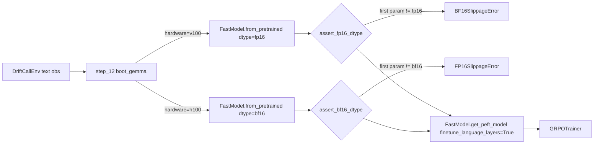

# Gemma 3n E2B Migration

## Confirmed decisions (from your answers)
- **Base model:** `unsloth/gemma-3n-E2B-it-unsloth-bnb-4bit` (instruction-tuned, Unsloth Dynamic 4-bit; closest functional swap for the current 4-bit pin).
- **Precision:** auto-pick from `DRIFTCALL_HARDWARE` env var. V100 -> FP16 + keep `BF16SlippageError` halt. H100 -> BF16 (matches Gemma 3n native dtype).
- **LoRA — hybrid:** keep `r=16, lora_alpha=32, lora_dropout=0.05, random_state=3407`, but switch to the Gemma 3n vision-aware API so audio/vision towers stay frozen and the language stack stays trainable: `finetune_vision_layers=False, finetune_language_layers=True, finetune_attention_modules=True, finetune_mlp_modules=True`. The explicit `target_modules=[q_proj, k_proj, v_proj, o_proj, gate_proj, up_proj, down_proj]` list is dropped (Unsloth derives the right modules from the flags for `gemma3n`).
- **Deps:** keep `trl>=0.23` and `transformers>=4.46` (preserves `use_bias_correction_kl=True` invariant), only **add** `timm>=1.0` (required by Gemma 3n vision tower even when frozen).
- **Repo IDs:** `driftcall/gemma-4-e2b-driftcall-lora` -> `driftcall/gemma-3n-e2b-driftcall-lora` (and the matching strings in `.driftcall.env`, scripts, tests, and the conclusion table).
- **Sampling temps for GRPO + eval:** unchanged (`SAMPLING_TEMPERATURE=0.9, SAMPLING_TOP_P=0.95` is GRPO config, not Gemma 3n inference; eval is greedy). Out of scope for this migration.

## High-level data flow after the change

## Files to change

### 1. Core model boot (heart of the migration)
- [`cells/step_12_gemma_boot.py`](cells/step_12_gemma_boot.py)
  - `BASE_MODEL_ID = "unsloth/gemma-3n-E2B-it-unsloth-bnb-4bit"`.
  - Add `HardwareT = Literal["v100", "h100"]` and `BootConfig.hardware: HardwareT = "v100"`.
  - Replace the constant `LORA_TARGET_MODULES` with new flags (`FINETUNE_VISION_LAYERS=False, FINETUNE_LANGUAGE_LAYERS=True, FINETUNE_ATTENTION_MODULES=True, FINETUNE_MLP_MODULES=True`).
  - In `boot_gemma`: pick `dtype` from `cfg.hardware`; pass through to `FastModel.from_pretrained(...)`. Drop `target_modules=...`; pass the four `finetune_*` flags + keep `r, lora_alpha, lora_dropout, use_gradient_checkpointing="unsloth", random_state` to `FastModel.get_peft_model`.
  - Replace `assert_fp16_dtype` with `assert_dtype_for_hardware(model, hardware)` that raises `BF16SlippageError` (existing class) on V100 if the param is not `torch.float16`, and a new `FP16SlippageError` on H100 if the param is not `torch.bfloat16`.

### 2. Trainer cells (mirror the boot changes)
- [`cells/step_15_train_stage1.py`](cells/step_15_train_stage1.py): docstrings only (`boot_gemma` already does the right thing once step 12 is updated). Doc text "Gemma 4 E2B" -> "Gemma 3n E2B".
- [`cells/step_16_train_stage2.py`](cells/step_16_train_stage2.py) and [`cells/step_17_train_stage3.py`](cells/step_17_train_stage3.py): in `_load_base_model`, plumb `cfg.hardware` -> `dtype` and call `assert_dtype_for_hardware(model, cfg.hardware)` instead of the hard-coded FP16 path. Doc text update.

### 3. GRPO config + WandB tags
- [`cells/step_13_grpo_config.py`](cells/step_13_grpo_config.py): change the wandb tag `"gemma-4-e2b"` -> `"gemma-3n-e2b"` (line 404). Sampling values stay.

### 4. Demo + deploy
- [`cells/step_23_demo_gradio.py`](cells/step_23_demo_gradio.py): `_BASE_MODEL_ID_DEFAULT` and `_TRAINED_ADAPTER_ID_DEFAULT` defaults + docstring. The `ModelLoader.__init__` defaults at line 263-264.
- [`demo/app_gradio.py`](demo/app_gradio.py): `_BASE_MODEL_ID_DEFAULT` (line 57) and `_TRAINED_ADAPTER_ID_DEFAULT` (line 58); module docstring.
- [`cells/step_24_deploy_hf.py`](cells/step_24_deploy_hf.py): `DEFAULT_LORA_REPO_ID = "driftcall/gemma-3n-e2b-driftcall-lora"`.
- [`cells/step_25_conclusion.py`](cells/step_25_conclusion.py) + [`cells/step_25_conclusion.md`](cells/step_25_conclusion.md): URL in `HUB_LINKS` and pitch line `"Gemma 4 E2B + GRPO + ..."`.

### 5. Tests (matching strings, no logic changes outside boot)
- [`tests/test_step_12_gemma_boot.py`](tests/test_step_12_gemma_boot.py): update `BASE_MODEL_ID` assertion, replace `target_modules` assertion with the four `finetune_*` flag assertions, add a hardware-axis test (V100 -> fp16 dtype passed; H100 -> bf16 dtype passed; halt asserts swap accordingly).
- [`tests/test_step_24_deploy_hf.py`](tests/test_step_24_deploy_hf.py): expect new repo id at line 78.
- [`tests/test_step_25_conclusion.py`](tests/test_step_25_conclusion.py): expect new URL at line 101.
- [`tests/test_wandb_setup.py`](tests/test_wandb_setup.py): expect tag `"gemma-3n-e2b"` at line 187.
- Tests at `tests/test_step_15/16/17_train_stage*.py` and `test_step_adaptive_kl_h100.py`: update any pinned model-id strings (none found in the fixtures themselves; they all monkey-patch `unsloth.FastModel`, so no change unless they assert on the LoRA kwargs - we'll re-run grep to confirm).

### 6. Docker + scripts + env
- [`Dockerfile.train`](Dockerfile.train): line 14 (env var doc) and line 92 (`snapshot_download(...)`) update to new model id.
- [`scripts/train_full.sh`](scripts/train_full.sh): line 9 (env var doc) and line 89 ("baseline eval (untrained Gemma 4 E2B...)") - text only.
- [`scripts/smoke_gemma4_boot.py`](scripts/smoke_gemma4_boot.py): rename to `scripts/smoke_gemma3n_boot.py` and update `_MODEL_ID`, prog name, and doc strings. Also update the lone reference in [`CLAUDE.md`](CLAUDE.md) lines 94 + 301.
- [`.driftcall.env`](.driftcall.env): `DRIFTCALL_HF_REPO=DGXAI/gemma-3n-e2b-driftcall-lora`, `WANDB_RUN_GROUP=driftcall-gemma-3n-e2b`.

### 7. Requirements
- [`requirements.txt`](requirements.txt) and [`pyproject.toml`](pyproject.toml): add `timm>=1.0` under the training stack (Gemma 3n needs `timm` even with vision frozen). Bump `transformers` floor to `>=4.51` (Gemma 3n config classes landed there). Keep `unsloth>=2026.4.5`, `trl>=0.23`. Re-generate `driftcall.egg-info/requires.txt` (auto, via `pip install -e .`).

### 8. Notebook artifact
- [`notebooks/train_driftcall.ipynb`](notebooks/train_driftcall.ipynb): regenerated by running `python3 notebooks/build_notebook.py` after the `cells/` edits land — no manual edit. Test [`tests/test_notebook_build.py`](tests/test_notebook_build.py) verifies it rebuilds byte-identically from the cells.

### 9. Module + design docs (text only — content changes)
- [`docs/modules/training.md`](docs/modules/training.md): replace the §3.1 code block, §3.2/§3.6/§4 references to "Gemma 4 E2B" and `unsloth/gemma-4-E2B-it-bnb-4bit`. Note the new LoRA flag API in §3.1.
- [`docs/modules/{deploy_demo_space,deploy_env_space,evaluation,risk_book,pitch_demo,task_generator,risk_book,audio}.md`](docs/modules) and the matching `docs/tests/*.md`: text-only "Gemma 4 E2B" -> "Gemma 3n E2B" and repo-id updates.
- [`README.md`](README.md), [`DESIGN.md`](DESIGN.md), [`CLAUDE.md`](CLAUDE.md): same text updates; CLAUDE.md additionally needs the new `BASE_MODEL_ID` constant in §0/§3.

## Out of scope (explicit)
- Audio/vision multimodal training. Gemma 3n's audio tower is frozen via `finetune_vision_layers=False`. The DriftCall env still hands the model text via the existing Kokoro+Whisper boundary; the trainer remains text-in/text-out.
- TRL or transformers downgrade. Keeping current floors preserves `use_bias_correction_kl` and the adaptive-KL callback that the Gemma 3N Colab does not exercise.
- Sampling temperatures. Gemma 3n's recommended `temperature=1.0, top_k=64, min_p=0.0` are inference defaults; GRPO uses its own sampling. Not changing here.

## Validation after edits
- `python3 -m pytest tests/test_step_12_gemma_boot.py tests/test_step_24_deploy_hf.py tests/test_step_25_conclusion.py tests/test_wandb_setup.py tests/test_notebook_build.py -v`
- `python3 -m pytest tests/ -k "not slow"` for the full suite.
- `python3 notebooks/build_notebook.py` to refresh the `.ipynb`.
- `python3 scripts/smoke_gemma3n_boot.py --no-gpu` for the import-only path; on a real GPU host: drop `--no-gpu` to verify the new pin loads.
