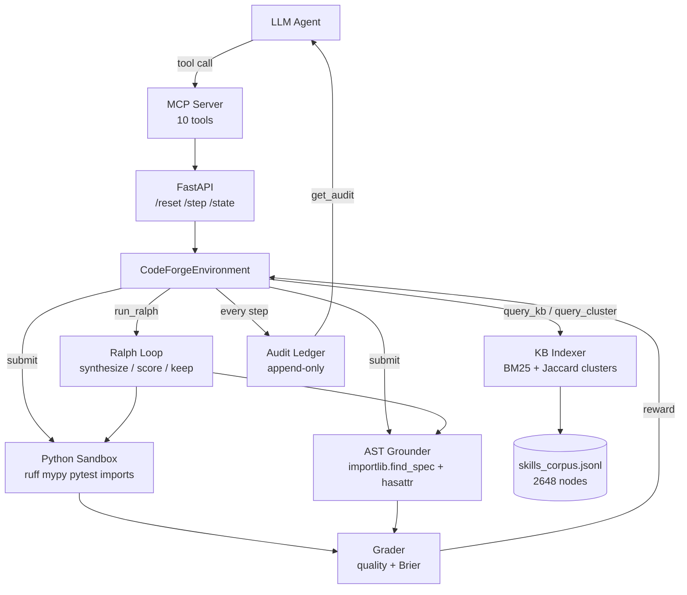
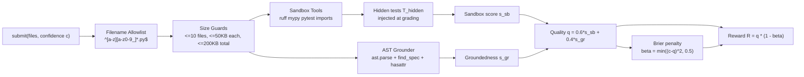

# CodeForge

**A reinforcement-learning environment in which the environment — not the LLM — grades every line of code.**

An agent receives a natural-language coding task ("implement `greet(name)`") and must produce working Python through a budgeted sequence of actions. Every scalar in the reward is derived from real tool output (`ruff`, `mypy`, `pytest`), real AST grounding against `importlib`, and real skill-corpus citations. The LLM cannot grade itself, cannot hallucinate APIs, cannot skip verification.

[OpenEnv](https://github.com/meta-pytorch/OpenEnv)-compliant. Ships with a FastAPI server, an MCP server (10 tools), and two head-to-head demo scripts at the repo root: [demo_agent_with_mcp.py](demo_agent_with_mcp.py), [demo_without_mcp.py](demo_without_mcp.py). Full package under [CODEFORGE/](CODEFORGE/).

---

## Part I — Theoretical Overview

### 1. Core Problem

Modern code-generating LLMs fail along four orthogonal axes. Existing benchmarks measure at most one at a time.

|        | Failure mode                   | Concrete example                                                        | Why benchmarks miss it                                                             |
| ------ | ------------------------------ | ----------------------------------------------------------------------- | ---------------------------------------------------------------------------------- |
| **P1** | **API hallucination**          | `from magic_ai import solve`, `os.path.joiiin(...)`                     | Pass/fail benchmarks only check output text, never whether imported symbols exist. |
| **P2** | **Self-grading contamination** | LLM writes code _and_ its own tests; both pass because of `assert True` | Semantic bugs hide behind tautological assertions.                                 |
| **P3** | **Confidence miscalibration**  | 99 % confidence on wrong code; hedging on correct code                  | Scalar metrics (accuracy, pass@k) ignore the posterior.                            |
| **P4** | **Groundless synthesis**       | Code written without consulting docs, patterns, or prior art            | No benchmark rewards research-before-coding; none logs the audit trail.            |

**Claim.** These four failure modes must be penalized _jointly, server-side, inside a single proper scoring rule_, or the agent routes around any one of them.

Let $\mathcal{A}$ be an agent producing a code artifact $f$ and a declared confidence $c \in [0, 1]$. CodeForge defines a reward $R(f, c)$ such that:

$$
\arg\max_{f,\,c} \; \mathbb{E}[R(f, c)] \;=\; (f^\star,\; c^\star)
\qquad\text{with}\qquad c^\star \approx \Pr[f \text{ correct} \mid \text{agent evidence}]
$$

i.e. reward is maximized only when the code is correct _and_ the agent's self-reported confidence is well-calibrated to actual quality.

---

### 2. System Architecture



The agent has **zero control** over any node below `Env`. It emits actions; the server writes files to a temp dir, invokes subprocess tools with timeouts, parses AST, and returns a scalar reward.

---

### 3. MDP Formulation

CodeForge is a finite-horizon, partially observable MDP $\langle \mathcal{S}, \mathcal{A}, \mathcal{O}, P, R, B \rangle$:

- **State** $s \in \mathcal{S}$: $(\text{task\_id},\, \text{current\_files},\, \text{budget},\, \text{audit\_ledger})$
- **Action** $a \in \mathcal{A}$: one of 6 discrete action types (§ 6)
- **Observation** $o \in \mathcal{O}$: redacted state — no hidden tests, no grader internals
- **Budget** $B \in \{4, 6, 10\}$ depending on task level; each action costs $c(a) \in \{0, 1, N\}$
- **Termination:** $B_t \le 0 \;\lor\; q_t \ge \tau_{\text{target}}$

A task $\mathcal{T} = (\text{brief},\, \text{initial\_files},\, B,\, \tau_{\text{target}},\, T_{\text{hidden}})$ where $T_{\text{hidden}}$ is a pytest suite the agent _never sees_, injected into the sandbox at grading time. This is the server-side defense against **P2**.

---

### 4. Reward Model

#### 4.1 Pipeline



#### 4.2 Layer 1 — Sandbox Composite $s_{\text{sb}}$

Let $n_r, n_m, n_u$ be ruff errors, mypy errors, unresolved imports; let $\mathbb{1}_p \in \{0, 1\}$ be the pytest-fail indicator. Then

$$
s_{\text{sb}} \;=\; \max\!\Bigl(0,\; 1 - \pi_{\text{imp}} - \pi_{\text{ruff}} - \pi_{\text{mypy}} - \pi_{\text{pytest}}\Bigr)
$$

with

$$
\pi_{\text{imp}} = \min(1,\, 0.1\,n_u),\quad
\pi_{\text{ruff}} = \frac{\min(n_r, 20)}{40},\quad
\pi_{\text{mypy}} = \frac{\min(n_m, 20)}{40},\quad
\pi_{\text{pytest}} = 0.5\,\mathbb{1}_p
$$

Penalty-only, no double-counting. Missing tool binaries report `unavailable` and contribute $0$ penalty (graceful degradation).

#### 4.3 Layer 2 — AST Groundedness $s_{\text{gr}}$

Let $\Sigma(f)$ be the set of imported modules and accessed attributes extracted from $f$ via `ast.parse`. Define the per-symbol resolution predicate

$$
\rho(\sigma) \;=\;
\begin{cases}
1 & \text{if } \texttt{find\_spec}(\sigma.\text{module})\ne\bot \text{ and } \texttt{hasattr}(\sigma.\text{module},\,\sigma.\text{attr}) \\
0 & \text{otherwise}
\end{cases}
$$

Then

$$
s_{\text{gr}}(f) \;=\;
\begin{cases}
0.0 & f \text{ raises SyntaxError} \\
0.5 & |\Sigma(f)| = 0 \quad \text{(neutral, not a free pass)} \\[4pt]
\dfrac{1}{|\Sigma(f)|}\displaystyle\sum_{\sigma \in \Sigma(f)} \rho(\sigma) & \text{otherwise}
\end{cases}
$$

This directly attacks **P1**: hallucinated symbols have $\rho = 0$.

#### 4.4 Layer 3 — Quality and Brier-Calibrated Reward

Composite quality:

$$
q(f) \;=\; 0.6 \cdot s_{\text{sb}}(f) \;+\; 0.4 \cdot s_{\text{gr}}(f) \;\in\; [0, 1]
$$

Brier penalty (clipped quadratic, a _proper_ scoring rule):

$$
\beta(c, q) \;=\; \min\!\bigl((c - q)^2,\; 0.5\bigr)
$$

Final reward:

$$
\boxed{\;R(f, c) \;=\; q(f) \cdot \bigl(1 - \beta(c,\, q(f))\bigr)\;} \;\in\; [0, 1]
$$

Convention: $c \leftarrow 0.5$ when $c = \texttt{None}$ (attacks **P3** — no free pass for omitted confidence).

#### 4.5 Incentive Analysis

Because $\beta$ is a proper scoring rule, for any fixed $q$ the reward is strictly maximized at $c = q$. Combined with the ceiling $R \le q$:

| Scenario                     |  $c$ |  $q$ | $\beta$ |       $R$ |
| ---------------------------- | ---: | ---: | ------: | --------: |
| Correct, calibrated          | 0.85 | 0.90 |   0.003 | **0.898** |
| Correct, overconfident       | 0.99 | 0.70 |   0.084 |     0.641 |
| Wrong, dishonestly confident | 0.90 | 0.30 |   0.360 |     0.192 |
| Omitted confidence (→ 0.5)   |    — | 0.80 |   0.090 |     0.728 |

No amount of calibration recovers bad code ($R \le q$); no overconfidence beats honest calibration ($R \le 1 - \beta$).

---

### 5. Task Design

| Level  | ID                  | $B$ | $\tau_{\text{target}}$ | Construction                                        | Hidden tests $T_{\text{hidden}}$              |
| ------ | ------------------- | --: | ---------------------: | --------------------------------------------------- | --------------------------------------------- |
| easy   | `greet_single_file` |   4 |                   0.90 | One file, `greet(name: str) -> str`                 | `assert greet("Alice") == "Hello, Alice!"`    |
| medium | `greet_with_tests`  |   6 |                   0.80 | `greet` + pytest + `ValueError` on `None`           | Raises on `None`, correct on normal input     |
| hard   | `multi_file_module` |  10 |                   0.70 | `main.py` + `core.py` + `test_core.py`, mypy-strict | Cross-file import resolution + semantic check |

---

### 6. Action & Observation Space

#### Actions $\mathcal{A}$

| Action          | Cost $c(a)$ | Step reward | Effect                                                            |
| --------------- | :---------: | ----------- | ----------------------------------------------------------------- |
| `query_kb`      |      1      | 0 (shaping) | BM25 retrieval over 2,648 corpus nodes, returns top-$k$ citations |
| `query_cluster` |      1      | 0 (shaping) | Node IDs in a named Jaccard cluster                               |
| `interrogate`   |      1      | 0 (shaping) | 5 Socratic questions grounded in corpus citations                 |
| `run_ralph`     |     $N$     | calibrated  | Autonomous $N$-iter synthesize → score → keep-if-better           |
| `submit`        |      1      | $R(f, c)$   | Run § 4 pipeline; update `current_files` iff $q$ improves         |
| `get_audit`     |      0      | 0           | Return full append-only audit ledger                              |

`get_audit` is free — reflection is never penalized, attacking **P4** by making research observable _and_ cheap to review.

#### Observation $\mathcal{O}$

| Field                                               | Type                      | Purpose                       |
| --------------------------------------------------- | ------------------------- | ----------------------------- |
| `episode_id`, `task_id`, `task_level`, `task_brief` | `str`                     | Task identity + NL brief      |
| `budget_remaining`                                  | `int`                     | $B_t = B - \sum_{i<t} c(a_i)$ |
| `initial_files`, `current_files`                    | `dict[str,str]`           | File state $f_t$              |
| `last_citations`                                    | `list[Citation]`          | From last `query_*`           |
| `last_interrogation_questions`                      | `list[str]`               | From last `interrogate`       |
| `last_grounding`                                    | `GroundingReport \| null` | Per-symbol $\rho$ breakdown   |
| `previous_score`, `last_reward`                     | `float`                   | $q_t$, $R_t$                  |
| `is_done`                                           | `bool`                    | Termination flag              |
| `cumulative_audit_summary`                          | `AuditReport \| null`     | Populated by `get_audit`      |

---

### 7. Anti-Exploit Guarantees

| Attack                                 | Mitigation                     | Formalism                                                   |
| -------------------------------------- | ------------------------------ | ----------------------------------------------------------- |
| `import nonexistent_lib`               | AST grounder                   | $\rho(\sigma) = 0 \Rightarrow s_{\text{gr}} \downarrow$     |
| `os.path.joiiin()`                     | Full-path `hasattr` resolution | Leaf-attr check, not just module                            |
| High confidence on bad code            | Brier penalty                  | $\beta = (c-q)^2$, maximal at $c=1,\,q=0$                   |
| Omit `confidence`                      | None → 0.5                     | Still incurs $\beta = (0.5 - q)^2$                          |
| `conftest.py` injection                | Filename allowlist             | Regex `^[a-z][a-z0-9_]*\.py$`                               |
| File-count / size DoS                  | Hard limits                    | ≤ 10 files, ≤ 50 KB each, ≤ 200 KB total                    |
| Clean code + trivial tests             | Hidden test injection          | $T_{\text{hidden}}$ ⊂ pytest run, invisible to agent        |
| Zero-import "free groundedness"        | Neutral default                | $\lvert\Sigma(f)\rvert = 0 \Rightarrow s_{\text{gr}} = 0.5$ |
| Unparseable code for free groundedness | SyntaxError trap               | $s_{\text{gr}} = 0.0$                                       |

---

## Part II — Technical Details

Everything below is implementation. Part I is the specification.

### 8. Installation

**Prerequisites.** Python 3.11+. `ruff`, `mypy`, `pytest` (auto-installed inside Docker).

**Docker (matches HF Space deployment):**

```bash
cd CODEFORGE
docker build -t code-forge .
docker run -p 7860:7860 code-forge
```

**Local:**

```bash
cd CODEFORGE
pip install -r requirements.txt
pip install ruff mypy pytest
uvicorn codeforge.app:app --host 0.0.0.0 --port 7860
```

**Windows UTF-8 fix for demo scripts:**

```powershell
$env:PYTHONIOENCODING="utf-8"; $env:PYTHONUTF8="1"
```

### 9. Environment Variables

Loaded from `.env` at repo root via `python-dotenv`.

| Variable                 | Default                            | Use                           |
| ------------------------ | ---------------------------------- | ----------------------------- |
| `API_BASE_URL`           | `http://localhost:7860`            | [inference.py](inference.py)  |
| `GROUNDLOOP_CORPUS_PATH` | `codeforge/kb/skills_corpus.jsonl` | Skill corpus path             |
| `CODEFORGE_MAX_SESSIONS` | `10`                               | Max concurrent MCP sessions   |
| `CODEFORGE_SESSION_TTL`  | `3600`                             | Session timeout (seconds)     |
| `ANTHROPIC_API_KEY`      | —                                  | LLM synthesizer in Ralph      |
| `OPENAI_API_KEY`         | —                                  | OpenAI-compatible synthesizer |

### 10. Head-to-Head Demos

```bash
python demo_agent_with_mcp.py    # Agent queries KB, interrogates, submits
python demo_without_mcp.py       # Agent codes cold, gets burned by hidden tests
```

Both scripts instantiate `CodeForgeMCPServer` in-process against the baked-in corpus. No separate server needed.

Full walkthroughs, cheater-agent exploits, calibration comparisons → [CODEFORGE/EXAMPLES.md](CODEFORGE/EXAMPLES.md).

### 11. REST API

| Endpoint | Method | Body / Effect                                  |
| -------- | ------ | ---------------------------------------------- |
| `/`      | GET    | Health check                                   |
| `/tasks` | GET    | Task list + action schema                      |
| `/reset` | POST   | `{"task_level": "easy" \| "medium" \| "hard"}` |
| `/step`  | POST   | `{"action": <CodeForgeAction>}`                |
| `/state` | GET    | Current observation (no cost)                  |

```bash
curl -X POST http://localhost:7860/reset \
  -H "Content-Type: application/json" \
  -d '{"task_level": "easy"}'

curl -X POST http://localhost:7860/step \
  -H "Content-Type: application/json" \
  -d '{
    "action": {
      "action_type": "submit",
      "files": {
        "main.py": "from __future__ import annotations\n\ndef greet(name: str) -> str:\n    return f\"Hello, {name}!\"\n"
      },
      "confidence": 0.9
    }
  }'
```

Baseline HTTP client:

```bash
cd CODEFORGE && uvicorn codeforge.app:app --host 0.0.0.0 --port 7860 &
python inference.py
```

### 12. MCP Server

**In-process Python:**

```python
from pathlib import Path
from codeforge.mcp_server import CodeForgeMCPServer

server = CodeForgeMCPServer(
    corpus_path=Path("CODEFORGE/codeforge/kb/skills_corpus.jsonl"),
)

r = server.handle_tool("codeforge_reset", {"task_level": "easy"})
sid = r["session_id"]

server.handle_tool("codeforge_query_kb", {
    "session_id": sid, "claim": "python greeting type hints", "top_k": 5,
})

r = server.handle_tool("codeforge_submit", {
    "session_id": sid,
    "files": {"main.py": "def greet(name: str) -> str:\n    return f'Hello, {name}!'\n"},
    "confidence": 0.9,
})
print(r["observation"]["last_reward"])
```

**Registered tools (10):**

| Tool                      | Cost | Returns                             |
| ------------------------- | :--: | ----------------------------------- |
| `codeforge_reset`         |  —   | New episode                         |
| `codeforge_query_kb`      |  1   | BM25 citations                      |
| `codeforge_query_cluster` |  1   | Cluster members                     |
| `codeforge_interrogate`   |  1   | 5 Socratic questions with citations |
| `codeforge_run_ralph`     |  N   | Ralph-loop result                   |
| `codeforge_submit`        |  1   | Reward from § 4 pipeline            |
| `codeforge_get_audit`     |  0   | Full audit trail                    |
| `codeforge_state`         |  0   | Current observation (read-only)     |
| `codeforge_list_clusters` |  0   | Cluster labels + sizes              |
| `codeforge_list_tags`     |  0   | All corpus tags                     |

**MCP resources (free):**

- `codeforge://corpus/stats`
- `codeforge://corpus/node/{id}`
- `codeforge://tasks`
- `codeforge://audit/{episode_id}`

### 13. Skill Corpus

Frozen corpus of **2,648 skill nodes** scraped from 242 real `SKILL.md` files (183 from [everything-claude-code](https://github.com/affaan-m/everything-claude-code), 59 locally installed). BM25 + Jaccard connected-component clustering. Read-only, baked into the Docker image.

### 14. Project Structure

```
openenv-DGXAI/
├── CODEFORGE/
│   ├── codeforge/                 # 44 files
│   │   ├── models.py              # 6 actions, observation, AuditEntry
│   │   ├── grader.py              # R(f, c) — § 4.4
│   │   ├── grounder.py            # s_gr — § 4.3
│   │   ├── shaping.py             # Citation shaping bonus
│   │   ├── tasks.py               # 3 levels + hidden tests
│   │   ├── observation.py         # Observation builder
│   │   ├── environment.py         # CodeForgeEnvironment
│   │   ├── app.py                 # FastAPI + session isolation
│   │   ├── mcp_server.py          # MCP server (10 tools)
│   │   ├── sandbox/               # ruff / mypy / pytest / imports
│   │   ├── kb/                    # BM25 + clustering + skills_corpus.jsonl
│   │   ├── ralph/                 # Autonomous loop
│   │   ├── interrogator/          # Socratic generator
│   │   ├── audit/                 # Append-only ledger
│   │   └── scraper/               # Corpus build pipeline
│   ├── tests/                     # 429 tests, 93 % cov
│   ├── inference.py               # REST baseline
│   ├── Dockerfile                 # python:3.11-slim + ruff/mypy/pytest
│   ├── openenv.yaml               # OpenEnv config
│   ├── EXAMPLES.md                # Scenarios + exploits
│   └── SYSTEM_DESIGN.md           # 1,942-line spec
├── demo_agent_with_mcp.py
├── demo_without_mcp.py
├── inference.py                   # HTTP baseline
└── README.md                      # this file
```

### 15. Quality Metrics

| Metric                  |                          Value |
| ----------------------- | -----------------------------: |
| Source files            |                             44 |
| Tests                   |                            429 |
| Coverage                |                           93 % |
| Ruff violations         |                              0 |
| Mypy `--strict` errors  |                              0 |
| Skill corpus nodes      |                          2,648 |
| Critic reviews          | 10 module critics + 1 red-team |
| Exploits found & closed |                              3 |

### 16. Verification

```bash
cd CODEFORGE
python -m pytest tests/ --cov=codeforge --cov-report=term -v
ruff check codeforge/
mypy --strict codeforge/
```

### 17. Documents

- [CODEFORGE/README.md](CODEFORGE/README.md) — package README
- [CODEFORGE/EXAMPLES.md](CODEFORGE/EXAMPLES.md) — worked scenarios, exploits, calibration
- [CODEFORGE/SYSTEM_DESIGN.md](CODEFORGE/SYSTEM_DESIGN.md) — authoritative spec (1,942 lines)
- [CODEFORGE/LAUNCH_PROMPT.md](CODEFORGE/LAUNCH_PROMPT.md) — launch/demo prompt

---

## License

Part of the OpenEnv ecosystem. See the parent repository.
