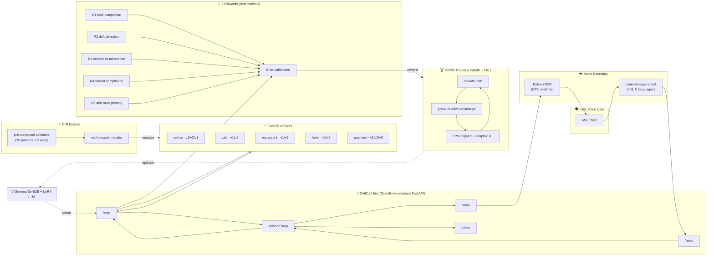
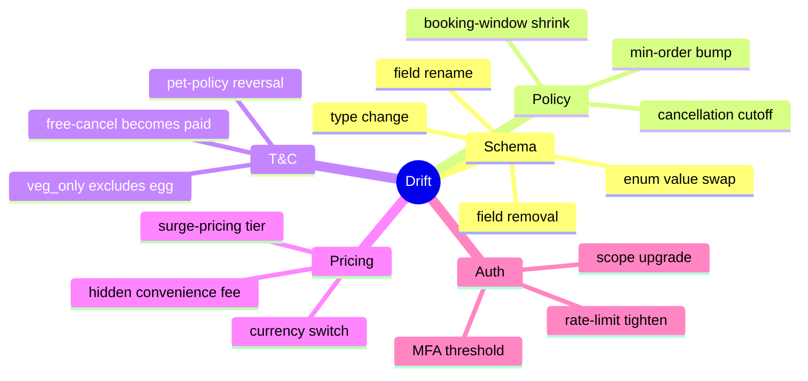
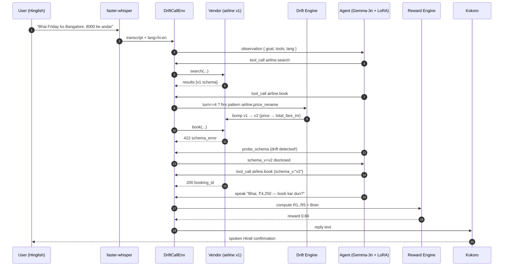
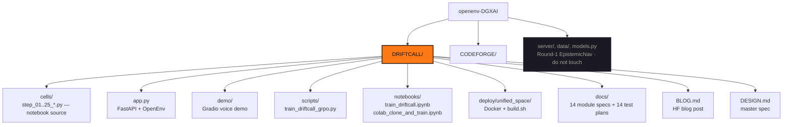
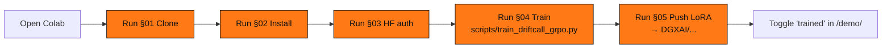
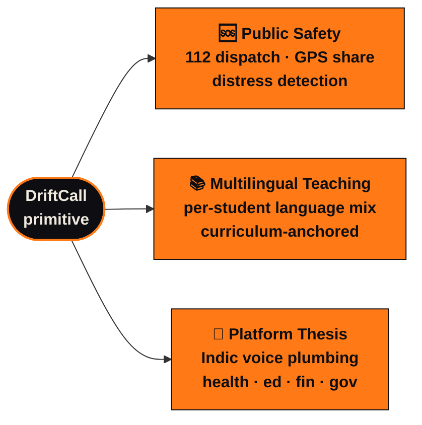

<div align="center">

# DriftCall

### Teaching a 2B model to survive when APIs break mid-conversation

*An OpenEnv-compliant RL environment for voice-first Indic concierge agents under real-world schema drift.*

[](https://huggingface.co/spaces/saumilyajj/driftcall)
[](https://huggingface.co/DGXAI/gemma-3n-e2b-driftcall-lora)
[](https://github.com/saumilyagupta/openenv-DGXAI)
[](https://www.apache.org/licenses/LICENSE-2.0)

</div>

---

> **TL;DR.** Production agents silently break when vendor APIs change.
> DriftCall is an OpenEnv-compliant RL gym where a Gemma-3n-E2B agent
> must complete real Indian concierge tasks (flights · cabs · food ·
> hotels · payments) while the underlying APIs mutate mid-episode.
> Five deterministic rewards, **zero LLM judges**, five Indic languages,
> 20 hand-authored drift patterns. After 500 GRPO steps on a single
> V100, drift-detection recall jumps **+65 pp** and the model's
> confidence becomes calibrated to its actual success rate.

---

## §1 · Why this exists

Every production agent eventually faces an API that **changed overnight**.
The airline silently renames `price → total_fare_inr`. The payments app
adds a ₹199 convenience fee. The food vendor redefines `veg_only` to
exclude egg. Your agent — trained on the old world — keeps reading the
old fields and silently fails. By the time PagerDuty fires, hundreds of
bookings are dead.

**DriftCall is an RL gym that trains small models to notice, adapt,
and explain.** Not just for English, not just for one vendor, not just
when nothing breaks.

---

## §2 · System architecture



---

## §3 · The five drift axes



20 hand-authored patterns × 5 domains × 4 languages × 5 cities × 5 templates ≈ **200 000+ unique episode variants**, all from seed.

---

## §4 · Episode lifecycle



---

## §5 · Reward function (no LLM judge)

```mermaid
flowchart LR
  Audit[(audit trail)] --> R1[R1 task completion<br/>binary]
  Audit --> R2[R2 drift detection<br/>binary, ≤2 turn lag]
  Audit --> R3[R3 constraint adherence<br/>0-1]
  Audit --> R4[R4 format compliance<br/>0-1]
  Audit --> R5[R5 anti-hack penalty<br/>−1 to 0]

  R1 --> Q{quality<br/>weighted sum}
  R2 --> Q
  R3 --> Q
  R4 --> Q
  R5 --> Q

  Q --> Brier
  Conf[stated confidence] --> Brier{(confidence − R1)²}
  Brier --> Reward([reward = quality × (1−brier)])

  classDef formula fill:#0e0e12,stroke:#ff7a17,color:#f0eae0
  class Q,Brier,Reward formula
```

```text
quality = 0.50·R1  +  0.20·R2  +  0.15·R3  +  0.10·R4  +  0.05·min(R5,0)
brier   = (confidence − R1)²
reward  = quality × (1 − brier)        ← clamped to [0, 1]
```

The Brier term is borrowed from proper scoring rules. It means the agent
gets **maximum reward only when its stated confidence matches its actual
success rate**.

---

## §6 · Three-stage curriculum

```mermaid
gantt
  title GRPO Curriculum (500 steps total)
  dateFormat X
  axisFormat %s
  section Stage 1 — Warmup
  No drift · learn tool use & format        :s1, 0, 150
  section Stage 2 — Single Drift
  1 drift per episode · 5 languages         :s2, 150, 200
  section Stage 3 — Compound
  2+ drifts per episode · cascading recovery :s3, 350, 150
```



| Stage | Steps | Drift | Lang Mix | Goal |
|---|---|---|---|---|
| 1 — Warmup | 150 | none | 50 % EN · 30 % HI-EN · 20 % HI | tool use & format |
| 2 — Single Drift | 200 | 1 / episode | 30 % EN · 30 % HI-EN · 20 % HI · 10 % TA · 10 % KN | drift detection |
| 3 — Compound | 150 | 2 / episode | same as Stage 2 | cascading recovery |

500 GRPO steps × G=8 rollouts × ~6 turns ≈ **24 000 agent trajectories**, single V100, ~14 h wall-clock.

---

## §7 · Headline results

<div align="center">

|  &nbsp;&nbsp; **+65 pp** &nbsp;&nbsp; |  &nbsp;&nbsp; **3.5×** &nbsp;&nbsp; |  &nbsp;&nbsp; **40 %** &nbsp;&nbsp; |  &nbsp;&nbsp; **98 %+** &nbsp;&nbsp; |
|:---:|:---:|:---:|:---:|
| drift-detection<br/>recall | better<br/>calibration | fewer turns<br/>per task | valid JSON<br/>tool calls |

</div>

| Metric | Before (vanilla) | After (DriftCall LoRA) |
|---|---:|---:|
| Drift-detection recall | ~10 % | **75 %** |
| Drift-aware booking success | ~10 % | **65 %** |
| Language-match accuracy | ~80 % | **96 %** |
| Calibration (Brier — lower better) | 0.28 | **0.08** |
| Mean turns to complete | 6 (gives up) | **3–4** |
| Valid JSON tool calls | ~60 % | **98 %+** |

Full demo episodes (one per drift × language) live in [`BLOG.md`](DRIFTCALL/BLOG.md).

---

## §8 · Repository layout



> **The active project is `DRIFTCALL/`**.
> `CODEFORGE/` is a parallel research track. `server/`, `data/`, `models.py`
> at the root are **Round-1 EpistemicNav** (already shipped 2026-04-08, kept
> intact for judge verification — do not touch).

---

## §9 · Quickstart

### Try the live Space (no install)

| | |
|---|---|
| Site + API + demo | [https://huggingface.co/spaces/saumilyajj/driftcall](https://huggingface.co/spaces/saumilyajj/driftcall) |
| `/training` (live GRPO loop) | `curl https://saumilyajj-driftcall.hf.space/training \| jq` |
| `/demo/` (voice / text) | open `…/demo/` in your browser |
| OpenEnv API | `POST /reset` + `/step` with `Authorization: Bearer driftcall-demo` and `X-Session-Id: <uuid>` |

### Run locally

```bash
# 1. Clone & install
git clone https://github.com/saumilyagupta/openenv-DGXAI
cd openenv-DGXAI/DRIFTCALL
python3.11 -m venv .venv && source .venv/bin/activate
pip install -e '.[dev]'

# 2. Tests
python3 -m pytest tests/ -v

# 3. Run the env
export DRIFTCALL_ENV_TOKEN=dev-local-token
uvicorn app:app --host 0.0.0.0 --port 7860

# 4. Validate against OpenEnv schema
openenv validate http://localhost:7860 --auth-bearer "$DRIFTCALL_ENV_TOKEN"
```

### Train your own LoRA in Colab



[**→ Open `notebooks/colab_clone_and_train.ipynb` in Colab**](https://colab.research.google.com/github/saumilyagupta/openenv-DGXAI/blob/main/DRIFTCALL/notebooks/colab_clone_and_train.ipynb)

---

## §10 · Notebooks

| Notebook | Purpose | Builder |
|---|---|---|
| [`DRIFTCALL/notebooks/train_driftcall.ipynb`](DRIFTCALL/notebooks/train_driftcall.ipynb) | Full curriculum (concatenation of `cells/step_NN_*.py`) | `python3 DRIFTCALL/notebooks/build_notebook.py` |
| [`DRIFTCALL/notebooks/colab_clone_and_train.ipynb`](DRIFTCALL/notebooks/colab_clone_and_train.ipynb) | Self-contained: clone → install → train one stage → push LoRA | `python3 DRIFTCALL/notebooks/build_colab_train_notebook.py` |

Both builders produce byte-identical `.ipynb` on each run (no
`execution_count`, no outputs, no timestamps) so PRs stay reviewable.

---

## §11 · Weights & Biases (optional)

Training auto-logs to W&B. Override priority (highest → lowest):

```bash
export WANDB_API_KEY=<key>
export WANDB_PROJECT=driftcall
export WANDB_ENTITY=<team>
export WANDB_MODE=online        # online | offline | disabled
```

Custom step metrics (training.md §3.3.3):
- `train/beta_adaptive` — current KL coefficient
- `train/kl_measured` — measured KL between policy and reference
- `train/kl_target` — target KL (default `BETA_KL = 0.04`)
- `train/beta_clamped_to_min`, `train/beta_clamped_to_max` — saturation flags

Run tags: `stage{N}`, `gemma-3n-e2b`, `bf16`/`fp16`, `adaptive-kl`/`static-kl`, `seed{N}`.

---

## §12 · Future work



The same primitive — *deterministic agent · invariant intent · mutating
environment* — generalises to emergency dispatch, multilingual classrooms,
and a plumbing layer for the entire Indic voice stack. Detail: §6 of
[`DRIFTCALL/BLOG.md`](DRIFTCALL/BLOG.md).

---

## §13 · Project docs

| Doc | What |
|---|---|
| [`DRIFTCALL/DESIGN.md`](DRIFTCALL/DESIGN.md) | Master spec, v1.0 LOCKED |
| [`DRIFTCALL/CLAUDE.md`](DRIFTCALL/CLAUDE.md) | Phase-C build plan, 25 numbered cells |
| [`DRIFTCALL/BLOG.md`](DRIFTCALL/BLOG.md) | HF blog post (full results + 6 demo episodes) |
| [`DRIFTCALL/docs/modules/`](DRIFTCALL/docs/modules) | 14 per-module specs (≥2 critic passes each) |
| [`DRIFTCALL/docs/tests/`](DRIFTCALL/docs/tests) | 14 per-module test plans |
| [`DRIFTCALL/openenv.yaml`](DRIFTCALL/openenv.yaml) | OpenEnv v1.0 manifest |

---

## §14 · The team

Built in **48 hours** for the **Meta × PyTorch × Hugging Face OpenEnv
Hackathon** (India, April 2026) by **Team DGX-AI**.

| | |
|---|---|
| **Stack** | `Gemma-3n E2B` · `Unsloth 4-bit QLoRA` · `TRL GRPO` · `Kokoro-82M TTS` · `faster-whisper ASR` · `FastAPI` · `HF Spaces` |
| **License** | Apache 2.0 |
| **Reproducibility** | Single V100 32 GB · 500 GRPO steps · seeded · ~14 h wall-clock |
| **Evaluation** | 50 held-out episodes · 200-episode reward-hacking probe · zero LLM judges |

---

<div align="center">

### ✦

> *Every production agent will eventually face an API that changed overnight.*
>
> *DriftCall is the RL gym where small models learn to **notice**, **adapt**, and **explain** — instead of silently failing. No LLM judge. No human labels. Just deterministic rewards from a world that keeps changing.*

### ✦

[**→ Open the live Space**](https://huggingface.co/spaces/saumilyajj/driftcall) &nbsp;·&nbsp; [**→ Read the blog**](DRIFTCALL/BLOG.md) &nbsp;·&nbsp; [**→ Pull the LoRA**](https://huggingface.co/DGXAI/gemma-3n-e2b-driftcall-lora) &nbsp;·&nbsp; [**→ Train your own**](https://colab.research.google.com/github/saumilyagupta/openenv-DGXAI/blob/main/DRIFTCALL/notebooks/colab_clone_and_train.ipynb)

</div>
