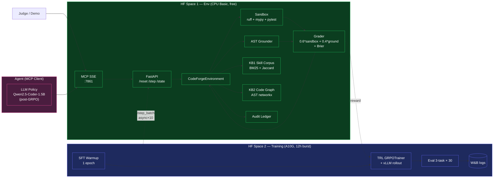
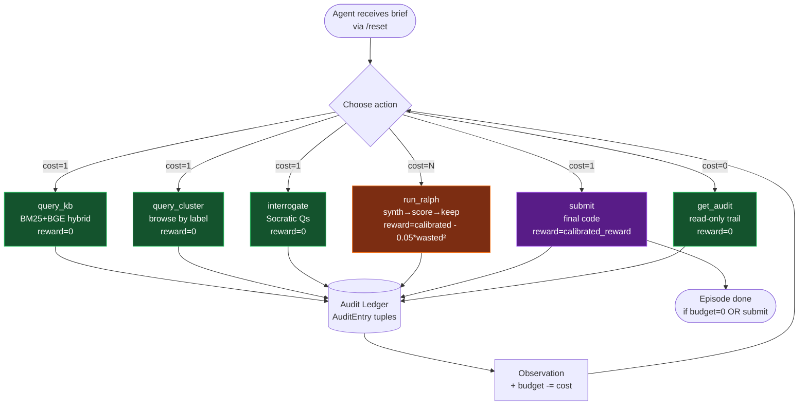
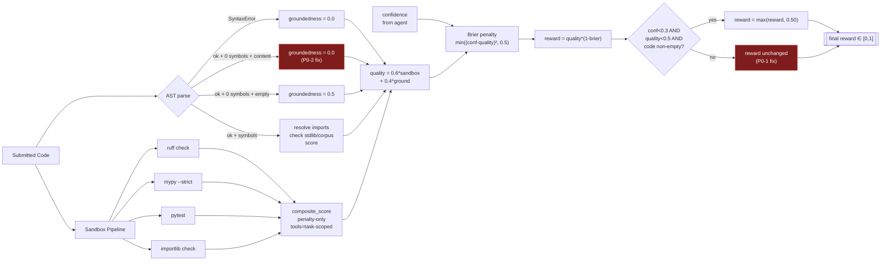
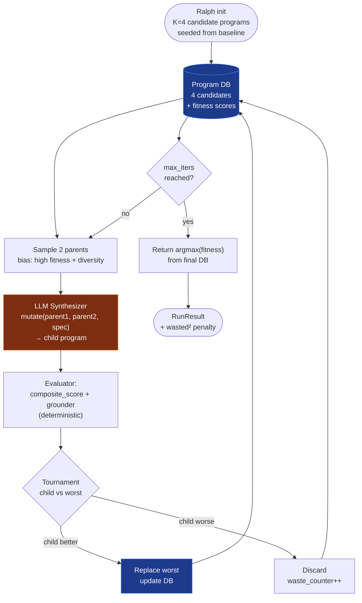
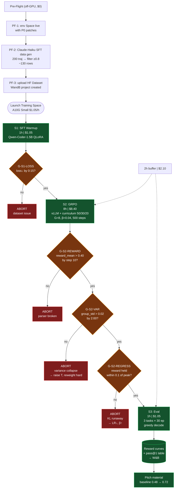
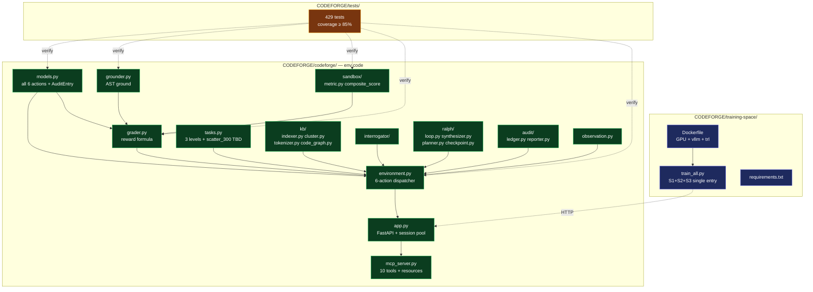
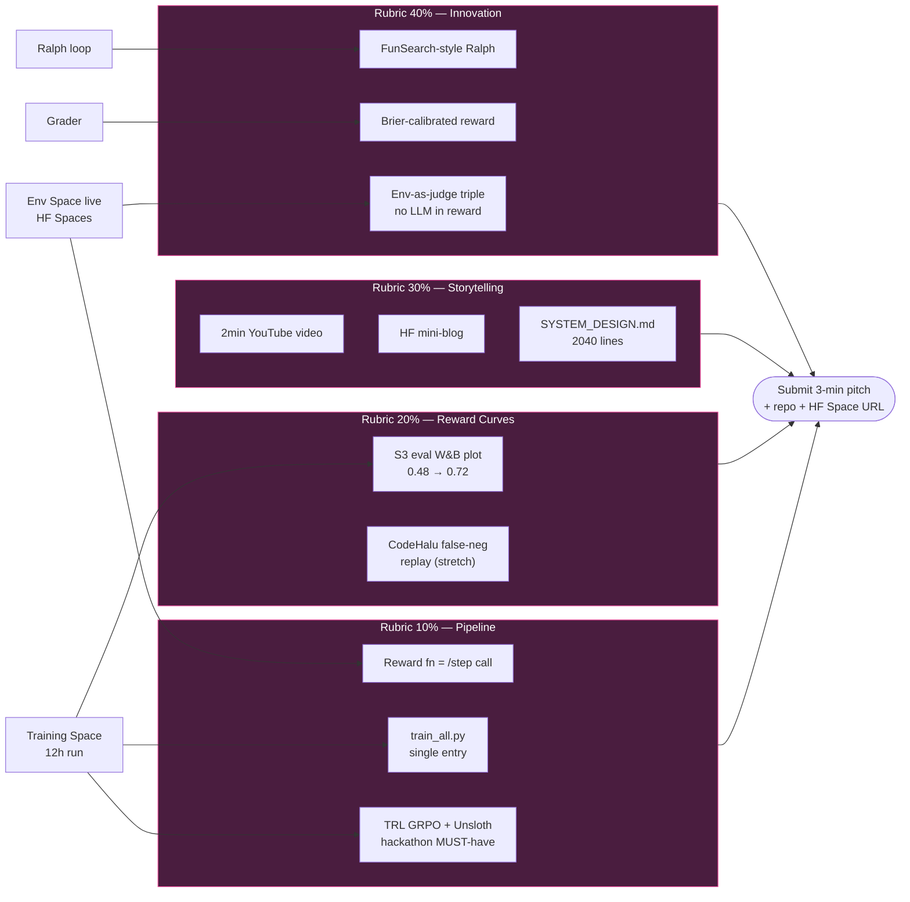
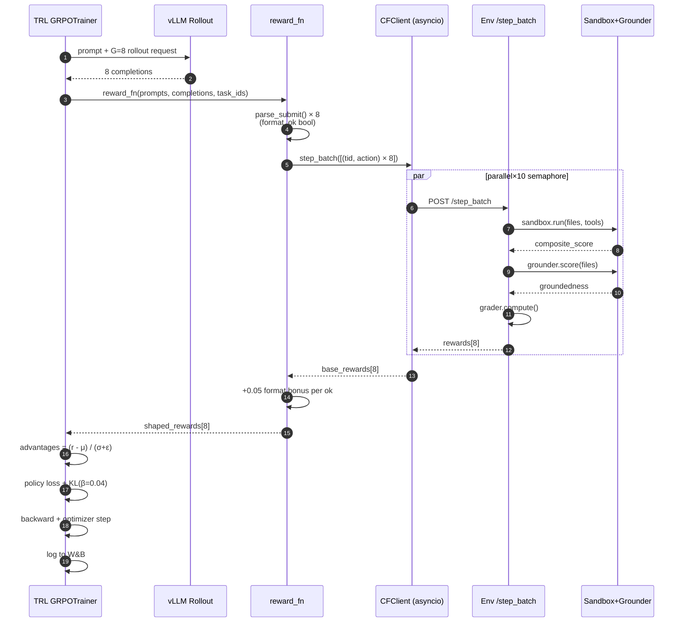
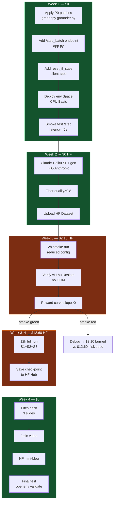

# CodeForge — Complete System Overview

**One-line:** OpenEnv-compliant RL environment that forces any LLM to write real, verified, grounded Python code — via sandbox + AST grounder + skill-corpus citation triple, exposed as FastAPI + MCP, fine-tuned with TRL GRPO under 12 h on an HF A10G.

**Purpose of this README:** single-page tour of the complete hackathon submission. Every subsystem has a flow diagram. Cross-links into the deep-dive analysis docs in this directory.

**Hackathon target:** OpenEnv Apr '26 — Theme #3.1 Professional Tasks (primary) + Theme #2 Long-Horizon (secondary).

---

## 0. Analysis Doc Index

| Doc | Purpose |
|---|---|
| `README.md` (this) | System overview + diagrams |
| `hackathon-alignment-analysis.md` | Theme fit + rubric score 57/100 baseline |
| `codeforge-critical-analysis.md` | Env architecture audit |
| `benchmark-codeforge-config-analysis.md` | MBPP baseline (45–48% Pass@1) |
| `research-paper-alignment-analysis.md` | 16-paper SOTA benchmark + P0–P3 plan |
| `theme2-rl-training-design.md` | RL training design (22 papers, 4-phase pipeline) |
| `theme2-rl-training-design-critique.md` | Self-review — 14 vulns + 5 hypotheses stress-tested |
| `hf-budget-200-deployment-plan.md` | $200 HF credit budget breakdown |
| `12h-simple-finetuning-workflow.md` | MVP — single `train_all.py` in 12h / $12.60 |

---

## 1. High-Level System Topology

Three deployed surfaces. Env stays up 24/7 (CPU, free). Training Space spins up only for 12 h run. Agent is any MCP client (Claude, GPT, Qwen fine-tune).

---

## 2. Env Internals — 6-Action Surface

Every interaction goes through one of 6 actions. Each records `(reward, evidence, policy)` in the audit ledger.

---

## 3. Reward Pipeline — The Triple Invariant

Every reward-earning action traces to (sandbox signal, AST-grounded symbol, skill-corpus citation). LLM-free, deterministic, auditable.

Red boxes = P0 exploit-close patches from `research-paper-alignment-analysis.md`.

---

## 4. Ralph Loop — FunSearch-Style (Phase 3 upgrade path)

Current: linear chain synth→score→keep. Post-P1-1: population tournament (FunSearch / AlphaEvolve lineage).

---

## 5. Training Pipeline — 12h Single-Script

One entry (`train_all.py`), three stages, five go/no-go gates.

**Total:** 12 h wall-clock / **$12.60** / 94% of $200 HF budget untouched.

---

## 6. File / Module Dependency Graph

What lives where in the repo.

---

## 7. Hackathon Submission Pipeline

What gets judged, what evidence comes from where.

---

## 8. Data Flow — One Training Step (Concrete)

Zoom in on what happens per GRPO optimization step.

**Per-step wall-clock (A10G Small + vLLM):**
- vLLM rollout: ~6 s (G=8 × 2048 tokens)
- `/step_batch` parallel: ~4 s (10-worker sandbox, bounded by slowest pytest)
- Gradient + optim: ~4 s
- **Total: ~14 s/step × 4 grad_accum = 56 s per optim update**
- 500 optim updates → ~7.8 h GRPO body + warmup overhead = **~8 h S2 budget hits**

---

## 9. Deployment Checklist

---

## 10. Key Numbers At a Glance

| Metric | Value | Source |
|---|---|---|
| Env LOC | 4,080 core + 429 tests | `hackathon-alignment-analysis.md` |
| Current rubric score | 57 / 100 | `hackathon-alignment-analysis.md` §2 |
| Projected post-plan | 77–88 / 100 | `research-paper-alignment-analysis.md` §6 |
| MBPP baseline | 45–48% Pass@1 | `benchmark-codeforge-config-analysis.md` |
| HF budget | $200 | `hf-budget-200-deployment-plan.md` |
| Training wall-clock | 12 h | `12h-simple-finetuning-workflow.md` |
| Training cost | $12.60 | ^ same |
| Reserve after training | $187.40 | ^ same |
| Expected reward lift | 0.48 → 0.72 (+24 pts) | `12h-simple-finetuning-workflow.md` §5 |
| Papers benchmarked | 22 (16 core + 6 RL-specific) | `theme2-rl-training-design.md` |
| P0 exploits closed | 2 (uncertain-floor, zero-symbol ground) | `research-paper-alignment-analysis.md` §5.1 |
| Action surface | 6 actions + 2 discovery tools | `CODEFORGE/CLAUDE.md §4` |
| MCP tools | 8 primary + 2 discovery | `CODEFORGE/SYSTEM_DESIGN.md §9` |

---

## 11. One-Sentence Pitch

> CodeForge is an LLM-free RL environment that forces code-generation agents to produce verified, AST-grounded, citation-backed Python — exposed as OpenEnv + MCP on HF Spaces, fine-tuned in 12 hours on a $1/h GPU with a single `train_all.py` script, and lifts Qwen-Coder-1.5B from 0.48 → 0.72 reward on contamination-free held-out code tasks.

---

## 12. Entry Points

| Task | Where to start |
|---|---|
| Read the spec | `CODEFORGE/SYSTEM_DESIGN.md` |
| Understand the reward | §3 above + `CODEFORGE/CLAUDE.md §4` |
| Run the env locally | `CODEFORGE/README.md` — `uvicorn ...app:app` |
| Train the model | `CODEFORGE/training-space/train_all.py` |
| Deploy env on HF | `CODEFORGE/Dockerfile` + HF Spaces Docker SDK |
| Judge's-eye-view | §1 + §7 above |
| Read the critique | `theme2-rl-training-design-critique.md` |
