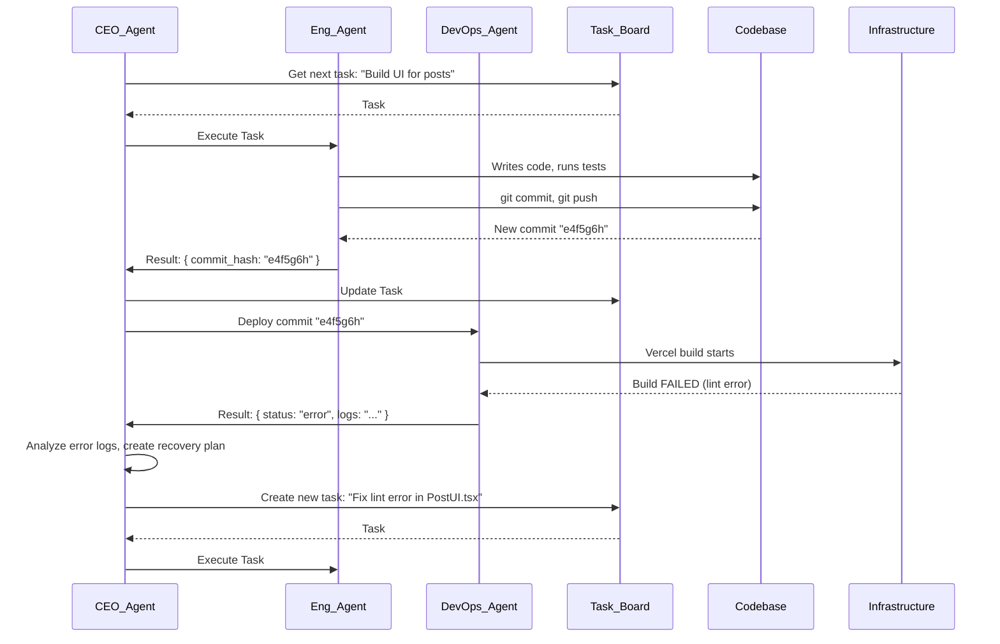

# Autonomous SaaS Factory: An OpenEnv Architecture (v2)

This document outlines the enhanced architecture for an "Autonomous SaaS Factory," an OpenEnv environment where a team of AI agents collaborates to build, deploy, and manage a full-fledged SaaS application. This iteration provides deeper technical detail on agent roles, communication protocols, state management, and error handling.

## 1. C4 Model System Context

The SaaS Factory is a meta-environment that takes high-level user goals and produces a deployed SaaS application.

```mermaid
graph TD
    A[User] -- "Build a Notion Clone" --> B{Autonomous SaaS Factory};
    B -- Manages & Deploys --> C[SaaS Application];
    B -- Uses --> D[Version Control (Git)];
    B -- Uses --> E[Infrastructure Platform (Supabase)];
    B -- Uses --> F[Hosting Platform (Vercel)];
    C -- Deployed On --> F;
    C -- Built With --> E;
    C -- Code Stored In --> D;
    G[End User] -- Uses --> C;

    style B fill:#1168bd,stroke:#fff,stroke-width:2px,color:#fff
```

## 2. The Reinforcement Learning (RL) Framework

This project uses RL at a high level of strategic decision-making. The core components of the RL framework are mapped as follows:

*   **The Environment**: The entire `SaaSFactoryEnv` class. It represents the "world" of building a software company, encapsulating the codebase, cloud services, and project plan. It manages the underlying systems and calculates results based on agent actions.

*   **The Agent**: The primary learning agent is the **CEO Agent (MCP)**. It functions as the "brain" of the operation, learning the optimal policy for building a startup. The other specialized agents (CTO, Engineer) act as the tools or "limbs" that the CEO Agent uses to execute its decisions.

*   **The State (S)**: The comprehensive JSON object returned by the `state()` function. It provides the CEO Agent with a complete, real-time view of the environment, including the current goal, system status, work-in-progress, and any errors.

*   **The Action (A)**: The set of high-level, strategic directives the CEO Agent can issue. Actions are not low-level commands like "type character 'x'," but rather strategic delegations like `"Delegate Task #12 (Fix lint error) to the Engineer Agent."` The agent's challenge is to learn which action to take in any given state to maximize its expected reward.

*   **The Reward (R)**: The feedback signal the environment provides after an action. The composite reward function is designed to incentivize real-world business value, such as large rewards for deploying major features, small rewards for completing sub-tasks, and negative rewards for build failures or errors.

Through this loop, the CEO Agent learns the *strategy* of software development—when to design, when to code, when to deploy, and how to recover from failures—by optimizing for long-term cumulative reward.

## 3. The OpenEnv Interface (Deep Dive)

### 3.1. The `state()` Object
The state is the comprehensive "digital twin" of the startup. It includes not only success metrics but also error states and the current work-in-progress.

```json
{
  "goal": "Build a Notion Clone with real-time collaboration",
  "status": "in_progress", // 'pending', 'in_progress', 'blocked', 'completed', 'error'
  "last_error": null, // or { "agent": "DevOps", "task": "deploy_frontend", "message": "Vercel build failed..." }
  "codebase": {
    "git_repo_url": "...",
    "last_commit_hash": "...",
    "test_coverage": 0.85
  },
  "infrastructure": {
    "supabase_project_id": "...",
    "database_schema_hash": "...", // A hash of the current schema to detect drift
    "deployment_url": "https://...",
    "status": "deployed_ok" // 'ok', 'deploying', 'error'
  },
  "product": {
    "features_implemented": ["auth_google", "crud_posts"],
    "task_board": [ // Mirrors the output of TaskList
      {"id": "1", "subject": "Design 'documents' schema", "status": "completed"},
      {"id": "2", "subject": "Implement 'documents' table migration", "status": "in_progress", "owner": "EngineerAgent"}
    ]
  },
  "business_metrics": {
    "users": 100, // Simulated
    "mrr": 10.00 // Simulated
  }
}
```

### 3.2. The `step(action)` and Reward Function
The `step` function now takes a more structured action. The reward is calculated based on tangible progress reflected in the state.

*   **Reward Logic**:
    *   **+100**: Major feature deployed (e.g., `crud_posts_with_rls` is completed and infrastructure status is `deployed_ok`).
    *   **+10**: A task on the `task_board` moves to `completed`.
    *   **+1**: Test coverage increases by 1%.
    *   **-5**: A task fails and needs to be re-attempted.
    *   **-50**: `infrastructure.status` moves to `error`.

## 4. The Agent Team: Roles, Tools, and Prompts

This section defines the "mind" and capabilities of each agent.

### 4.1. CEO Agent (Orchestrator)
*   **Prompt Philosophy**: "You are the CEO of a startup. Your goal is to achieve the user's vision. Analyze the current state, the long-term goal, and the available tasks. Decide the next most important task and delegate it to the appropriate team member. If the system is in an error state, formulate a recovery plan."
*   **Tools**: `TaskList`, `TaskCreate`, `TaskUpdate`, `Agent` (to spawn other agents).
*   **Input**: The full `state()` object.
*   **Output**: A call to another agent with a specific task ID.
    *   `Agent(subagent_type="product-manager", prompt="The current goal is 'Add a blog'. Break this down into actionable tickets. Task ID: 3")`

### 4.2. CTO Agent (Architect)
*   **Prompt Philosophy**: "You are a world-class Solutions Architect. You receive a high-level technical goal. Your job is to produce a clear, unambiguous technical design, including database schemas (SQL DDL), API contracts (OpenAPI spec), and file structures. You do not write implementation code."
*   **Tools**: `Write` (to save design docs), `Read`.
*   **Input**: A task like `"Design blog schema & API"`.
*   **Output**: A file path to a markdown document containing the design.
    *   `Result: { design_doc_path: "/designs/blog_feature.md" }`

### 4.3. Product Manager Agent (Planner)
*   **Prompt Philosophy**: "You are a Product Manager. You translate business goals into a backlog of well-defined, atomic tasks for the engineering team. For each task, define clear acceptance criteria."
*   **Tools**: `TaskCreate`, `TaskUpdate`.
*   **Input**: A goal like `"Add a blog"`.
*   **Output**: A list of newly created task IDs.

### 4.4. Software Engineer Agent (Builder)
*   **Prompt Philosophy**: "You are a senior software engineer. You will be given a single, specific task from the task board. Read the associated design documents, then implement the required code. Write unit and integration tests for your code. Adhere to the existing coding standards."
*   **Tools**: `Read`, `Write`, `Edit`, `Bash` (for running tests, linters, git).
*   **Input**: A Task ID (e.g., `"Implement 'documents' table migration"`).
*   **Output**: A git commit hash.
    *   `Result: { commit_hash: "a1b2c3d" }`

### 4.5. DevOps Agent (Deployer)
*   **Prompt Philosophy**: "You are a DevOps specialist. Your job is to manage the cloud infrastructure and CI/CD pipelines. You will be asked to provision resources or deploy new versions of the application. You primarily use the Supabase and Vercel CLI tools. You must ensure the health of the deployed application."
*   **Tools**: `Bash` (to run `supabase`, `vercel`, `git` commands).
*   **Input**: A trigger action, like a new commit on the `main` branch.
*   **Output**: A status update.
    *   `Result: { deployment_status: "ok", url: "https://..." }` or `Result: { deployment_status: "error", logs: "..." }`

## 5. Refined Workflow with Error Handling


This refined architecture provides a more robust and detailed blueprint for the Autonomous SaaS Factory, making it a more challenging and realistic project for the hackathon.
