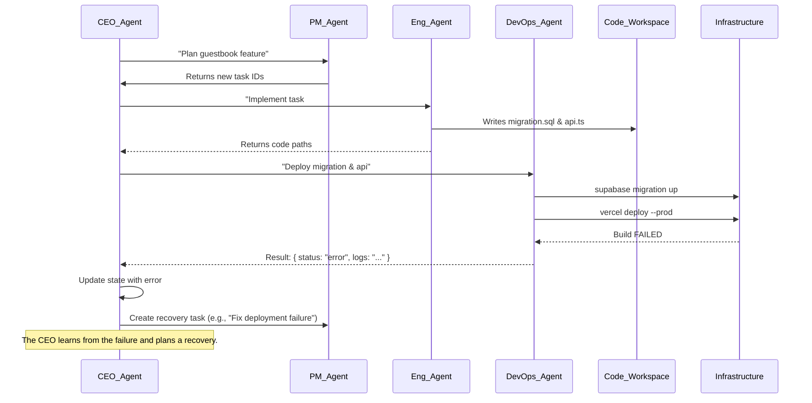

# Autonomous SaaS Factory: An OpenEnv Architecture (v3)

This document outlines the architecture for an "Autonomous SaaS Factory." It's an OpenEnv project where a team of Reinforcement Learning (RL) powered AI agents collaborates to build, deploy, and manage a SaaS application. The system is designed around a primary CEO agent that learns the optimal policy for building a startup by delegating tasks to a specialized team.

## 1. C4 Model System Context

The SaaS Factory is a meta-environment that takes high-level user goals and produces a deployed SaaS application.

```mermaid
graph TD
    A[User] -- "Build a Notion Clone" --> B{Autonomous SaaS Factory};
    B -- Manages & Deploys --> C[SaaS Application];
    B -- Uses --> D[Version Control (Git)];
    B -- Uses --> E[Infrastructure Platform (Supabase)];
    B -- Uses --> F[Hosting Platform (Vercel)];
    C -- Deployed On --> F;
    C -- Built With --> E;
    C -- Code Stored In --> D;
    G[End User] -- Uses --> C;

    style B fill:#1168bd,stroke:#fff,stroke-width:2px,color:#fff
```

## 2. The Reinforcement Learning Framework

The project is built on a Reinforcement Learning (RL) model where agents learn and improve over time.

*   **The Environment**: The `SaaSFactoryEnv` class represents the software project, encapsulating the codebase, cloud services (Supabase), and deployment target (Vercel).
*   **The CEO Agent (Orchestrator)**: The primary learning agent. It analyzes the environment's state, decides on the next high-level action, and delegates it to the appropriate specialized agent. Its goal is to learn the most effective sequence of actions to build a successful product.
*   **Specialized Agents**: Each team member (CTO, PM, Engineer, etc.) is also an RL agent. They learn to become better at their specific function. For example, a Frontend Engineer agent might learn from scraping well-designed websites to improve its own UI generation, while a Marketing agent learns which ad copy performs best.
*   **The State (S)**: A comprehensive JSON object that tracks the current goal, codebase status, infrastructure health, product backlog, and business metrics.
*   **The Action (A)**: A structured object representing a high-level task delegated by the CEO, such as `{"agent": "Engineer", "task": "Implement 'documents' table migration"}`.
*   **The Reward (R)**: A numerical value calculated from changes in the state, rewarding tangible progress like completing tasks, increasing test coverage, or successful deployments.

## 3. The Agent Team: Roles, Tools, and Prompts

This section defines the roles and capabilities of each agent.

### 3.1. CEO Agent (Orchestrator)
*   **Role**: The "brain" of the operation. It's the primary learning agent that manages the overall strategy, delegating tasks to the specialized team.
*   **Logic**:
    1.  Analyze the current `state()`.
    2.  Choose the next action (e.g., call the Product Manager to plan features).
    3.  Execute `step(action)` by calling the appropriate agent.
    4.  Observe the new state and reward to update its policy.
*   **Tools**: `SaaSFactoryEnv` interface, other agents.
*   **Input**: The full environment state.
*   **Output**: A specific action for another agent to perform.

### 3.2. CTO Agent (Architect)
*   **Prompt Philosophy**: "You are a Solutions Architect. You receive a feature request and produce a clear, machine-readable technical design, including database schemas and API contracts."
*   **Tools**: LLM SDK, `Write`.
*   **Input**: A task like `"Design a guestbook schema"`.
*   **Output**: A file containing the SQL DDL or API specification.

### 3.3. Product Manager Agent (Planner)
*   **Prompt Philosophy**: "You are a Product Manager. You translate business goals into a backlog of well-defined, atomic tasks for the engineering team."
*   **Tools**: `TaskCreate`, `TaskUpdate`.
*   **Input**: A goal like `"Add a blog"`.
*   **Output**: A list of newly created task IDs.

### 3.4. Software Engineer Agent (Builder)
*   **Prompt Philosophy**: "You are a senior software engineer. You implement code for specific tasks, including writing unit and integration tests."
*   **Tools**: `Read`, `Write`, `Edit`, `Bash`.
*   **Input**: A task ID and relevant design documents.
*   **Output**: File paths of the generated code.

### 3.5. DevOps Agent (Deployer)
*   **Prompt Philosophy**: "You are a DevOps specialist. You manage cloud infrastructure and CI/CD pipelines, primarily using the Supabase and Vercel CLI tools."
*   **Tools**: `Bash` (to run `supabase`, `vercel` commands).
*   **Input**: File paths for the code to be deployed.
*   **Output**: A status update and deployment URL.

## 4. Development Workflow with Error Handling

The workflow is a loop managed by the CEO agent, with mechanisms to handle failures.


