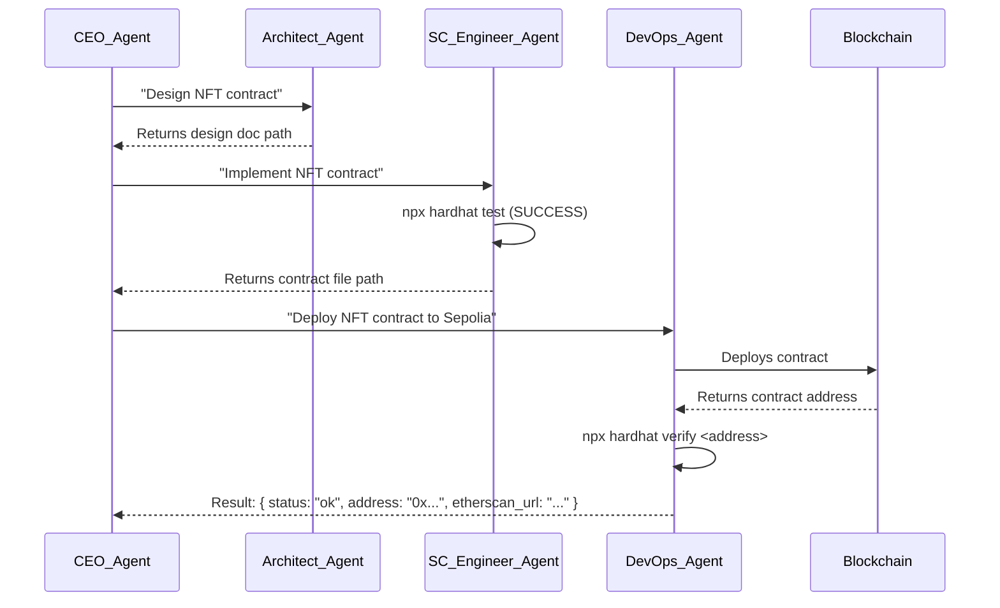

# Autonomous Web3 Factory: An OpenEnv Architecture (v4)

This document outlines the architecture for an "Autonomous Web3 Factory." It's an OpenEnv project where a team of Reinforcement Learning (RL) powered AI agents collaborates to build, deploy, and manage decentralized applications (dApps). The system is designed to take high-level product goals and autonomously generate the necessary smart contracts, frontend interfaces, and deployment scripts.

## 1. C4 Model System Context

The Web3 Factory is a meta-environment that takes high-level goals and produces a deployed dApp on a public blockchain.

```mermaid
graph TD
    A[User] -- "Build a decentralized voting system" --> B{Autonomous Web3 Factory};
    B -- Deploys --> C[Smart Contracts (e.g., Ethereum)];
    B -- Deploys --> D[Frontend dApp (e.g., IPFS/Vercel)];
    B -- Uses --> E[Version Control (Git)];
    B -- Uses --> F[Blockchain Tools (Hardhat/Foundry)];
    G[End User] -- Interacts via Wallet --> D;
    D -- Interacts with --> C;

    style B fill:#1168bd,stroke:#fff,stroke-width:2px,color:#fff
```

## 2. The Reinforcement Learning Framework

The project is built on a Reinforcement Learning (RL) model where agents learn to build successful dApps.

*   **The Environment**: The `Web3FactoryEnv` class represents the dApp project, encapsulating the smart contract codebase, frontend code, and blockchain state.
*   **The CEO Agent (Orchestrator)**: The primary learning agent. It analyzes the environment's state, including on-chain data and development progress, to decide on the next high-level action. Its goal is to learn the most effective strategy for building and launching a successful dApp.
*   **Specialized Agents (Web3 Focus)**: Each agent is an RL-powered specialist for the Web3 stack. They learn to improve at their specific function, such as optimizing smart contracts for gas efficiency or designing user-friendly wallet interactions.
*   **The State (S)**: A comprehensive JSON object tracking the project's goal, smart contract verification status, deployment addresses, frontend URLs, and tokenomics metrics.
*   **The Action (A)**: A structured command from the CEO, such as `{"agent": "SmartContractEngineer", "task": "Write ERC721 contract for collectible items"}`.
*   **The Reward (R)**: A value calculated from on-chain and off-chain events. Rewards are given for successful contract deployments, verified contracts on Etherscan, positive user interactions, and reduced gas costs.

## 3. The Web3 Agent Team: Roles, Tools, and Prompts

### 3.1. CEO Agent (Orchestrator)
*   **Role**: Manages the high-level strategy for dApp creation.
*   **Tools**: `Web3FactoryEnv` interface, other agents.

### 3.2. Web3 Architect Agent (formerly CTO)
*   **Prompt Philosophy**: "You are a Web3 Solutions Architect. You design the on-chain and off-chain architecture for a dApp, including smart contract patterns, data storage solutions (IPFS/Arweave), and tokenomics."
*   **Tools**: LLM SDK, `Write`.
*   **Input**: A goal like `"Design a decentralized identity system"`.
*   **Output**: A design document specifying contract interfaces and data models.

### 3.3. Smart Contract Engineer Agent
*   **Prompt Philosophy**: "You are a Smart Contract Engineer. You write secure, gas-efficient, and well-tested Solidity code based on a technical design. You use industry best practices from OpenZeppelin and ConsenSys."
*   **Tools**: `Read`, `Write`, `Edit`, `Bash` (for Hardhat/Foundry commands like `npx hardhat compile` and `npx hardhat test`).
*   **Input**: A design document.
*   **Output**: The file path to the new `.sol` contract file and its test file.

### 3.4. Frontend dApp Engineer Agent
*   **Prompt Philosophy**: "You are a Frontend dApp Engineer. You build responsive user interfaces that connect to user wallets (e.g., MetaMask) and interact with smart contracts using libraries like ethers.js or web3.js."
*   **Tools**: `Read`, `Write`, `Edit`, `Bash` (`npm install`, `npm run dev`).
*   **Input**: A smart contract ABI and deployment address.
*   **Output**: A running URL for the frontend application.

### 3.5. Blockchain DevOps Agent
*   **Prompt Philosophy**: "You are a Blockchain DevOps specialist. You manage the deployment and verification of smart contracts. You handle deployment scripts, private key management (via environment variables), and contract verification on Etherscan."
*   **Tools**: `Bash` (to run `npx hardhat run deploy.js --network sepolia`).
*   **Input**: A compiled smart contract artifact.
*   **Output**: The transaction hash of the deployment and the verified contract address.

## 4. Web3 Development Workflow


